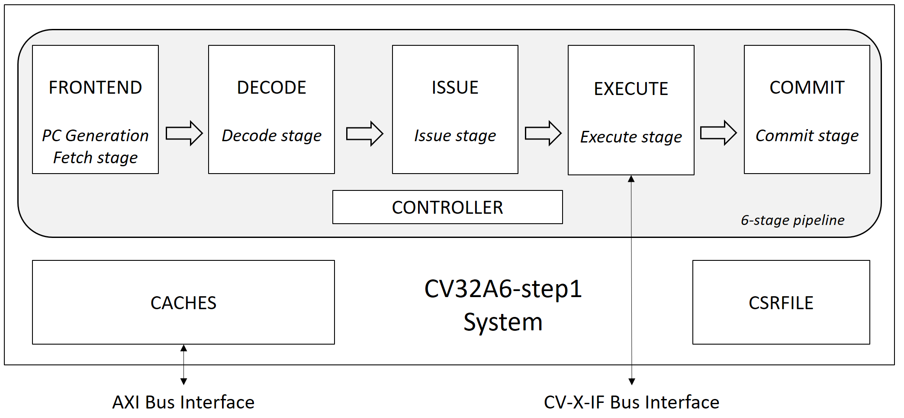

..
   Copyright 2022 Thales DIS design services SAS
   Licensed under the Solderpad Hardware Licence, Version 2.0 (the "License");
   you may not use this file except in compliance with the License.
   SPDX-License-Identifier: Apache-2.0 WITH SHL-2.0
   You may obtain a copy of the License at https://solderpad.org/licenses/

   Original Author: Jean-Roch COULON (jean-roch.coulon@thalesgroup.com)

.. _SYSTEM:

CV32A6-step1 System
===================

Description
-----------

The CV32A6-step1 is a system composed of the subsystems and protocol interfaces as illustrated in the figure. The processor is a Harvard-based modern architecture. Instructions are issued in-order through the DECODE stage and executed out-of-order but committed in-order. The processor is Single issue, that means that at maximum one instruction per cycle can be issued to the EXECUTE stage.

The CV32A6-step1 implements a 6-stage pipeline composed of PC Generation, Instruction Detch, Instruction Decode, Issue stage, Execute stage and Commit stage. At least 6 cycles are needed to execute one instruction.

.. list-table:: cv32a6-step1 interface signals
   :header-rows: 1

   * - Signal
     - IO
     - Type
     - Description

   * - ``clk_i``
     - in
     - logic
     - system clock

   * - ``rst_ni``
     - in
     - logic
     - Asynchronous reset active low

   * - ``boot_addr_i``
     - in
     - logic[VLEN-1:0]
     - Reset boot address

   * - ``hart_id_i``
     - in
     - logic[XLEN-1:0]
     - Hart id in a multicore environment (reflected in a CSR)

   * - ``irq_i``
     - in
     - logic[1:0]
     - Level sensitive IR lines, mip & sip (async)

   * - ``ipi_i``
     - in
     - logic
     - Inter-processor interrupts (async)

   * - ``time_irq_i``
     - in
     - logic
     - Timer interrupt in (async)

   * - ``debug_req_i``
     - in
     - logic
     - Debug request (async)

   * - ``rvfi_o``
     - out
     - trace_port_t
     - RISC-V Formal Interface port (RVFI)

   * - ``cvxif_req_o``
     - out
     - cvxif_req_t
     - Coprocessor Interface request interface port (CV-X-IF)

   * - ``cvxif_resp_i``
     - in
     - cvxif_resp_t
     - Coprocessor Interface response interface port (CV-X-IF)

   * - ``axi_req_o``
     - out
     - req_t
     - AXI master request interface port

   * - ``axi_resp_i``
     - in
     - resp_t
     - AXI master response interface port

Functionality
-------------

CV32A6-step1 implements a configuration which allows to connect coprocessor to it through CV-X-IF coprocessor interface, but the lack of MMU and A extension prevent from executing Linux.

.. list-table:: CV32A6-step1 Configuration
   :header-rows: 1

   * - Standard Extension
     - Specification
     - Configurability

   * - **I**: RV32i Base Integer Instruction Set
     - [RVunpriv]
     - enabled

   * - **C**: Standard Extension for Compressed Instructions
     - [RVunpriv]
     - enabled

   * - **M**: Standard Extension for Integer Multiplication and Division
     - [RVunpriv]
     - enabled

   * - **A**: Standard Extension for Atomic transaction
     - [RVunpriv]
     - disabled

   * - **F and D**: Single and Double Precision Floating-Point
     - [RVunpriv]
     - disabled

   * - **Zicount**: Performance Counters
     - [RVunpriv]
     - disabled

   * - **Zicsr**: Control and Status Register Instructions
     - [RVpriv]
     - enabled

   * - **Zifencei**: Instruction-Fetch Fence
     - [RVunpriv]
     - enabled

   * - **Privilege**: Standard privilege modes M, S and U
     - [RVpriv]
     - enabled

   * - **SV39, SV32, SV0**: MMU capability
     - [RVpriv]
     - disabled

   * - **PMP**: Memory Protection Unit
     - [RVpriv]
     - disabled

   * - **CSR**: Control and Status Registers
     - [RVpriv]
     - enabled

   * - **I$**: Instruction cache micro-architecture
     - current spec
     - enabled

   * - **D$**: Data cache micro-architecture
     - current spec
     - disabled

   * - **Rename**: register Renaming micro-architecture to increase perf
     - current spec
     - disabled

   * - **Double Commit**: pipeline micro-architecture
     - current spec
     - enabled

   * - **BP**: Branch Prediction micro-architecture
     - current spec
     - enabled but without information storage

   * - **AXI**: AXI interface
     - [CV-X-IF]
     - enabled

   * - **TRI**: Translation Response Interface (TRI)
     - [OpenPiton]
     - disabled

CVA6 memory interface complies with AXI5 specification including the Atomic_Transactions property support as defined in [AXI] section E1.1.

CVA6 coprocessor interface complies with CV-X-IF protocol specification as defined in [CV-X-IF].

The CV32A4-step1 core is fully synthesizable. It has been designed mainly for ASIC designs, but FPGA synthesis is supported as well.

For ASIC synthesis, the whole design is completely synchronous and uses positive-edge triggered flip-flops. The core occupies an area of about 80 kGE. The clock frequency can be more than 1GHz depending of technology.

Architecture
------------

   CV32A6-step1 System

